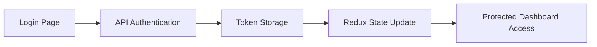

#  Dashboard Application

<div align="center">
  
</div>

A modern, responsive Customer Relationship Management (CRM) dashboard built with React, Redux Toolkit, and Chart.js. This application provides comprehensive product management capabilities with real-time analytics and beautiful visualizations.


##  Features

###  Authentication System
- **Secure Login**: Token-based authentication with Redux state management
- **Beautiful UI**: Glassmorphism design with gradient backgrounds
- **Protected Routes**: Private route protection for authenticated users

Note: Due to dummy login, we have set a demo credential for default login. More such credentials can be found from the dummy api

###  Interactive Dashboard
- **Real-time Analytics**: Live data visualization with Chart.js integration
- **Multiple Chart Types**: 
  - Line charts for sales & revenue trends
  - Bar charts for monthly revenue analysis
  - Doughnut charts for customer distribution
- **Statistics Cards**: Key metrics overview (Total Revenue, Customers, Sales, Products)
- **Responsive Design**: Works perfectly on desktop, tablet, and mobile devices

###  Product Management (CRUD)
- **Complete CRUD Operations**: Create, Read, Update, Delete products
- **Smart Pricing System**: 
  - Dynamic price calculations with discount support
  - Original price persistence
  - Real-time price updates based on discount percentage
- **Advanced Search**: Search across title, description, category, and brand
- **Pagination**: Efficient data loading with pagination
- **Local & API Integration**: Hybrid system supporting both local and API products
- **Visual Indicators**: Special badges for newly added products

###  Modern UI/UX
- **Responsive Tables**: Mobile-friendly with horizontal scrolling
- **Interactive Elements**: Hover effects and smooth transitions
- **Professional Styling**: Clean, modern interface with consistent design
- **Status Indicators**: Color-coded stock levels and status badges

##  Tech Stack

### Frontend
- **React 19.1.0** - Modern React with latest features
- **Redux Toolkit 2.8.2** - State management with modern Redux patterns
- **React Router DOM 7.7.0** - Client-side routing
- **Chart.js 4.5.0** - Interactive charts and visualizations
- **React-ChartJS-2 5.3.0** - React wrapper for Chart.js
- **Axios 1.11.0** - HTTP client for API requests

### External APIs
- **DummyJSON API** - Mock data for products, users, and carts

##  Getting Started

### Prerequisites
- Node.js (version 16 or higher)
- npm or yarn package manager

### Installation

1. **Clone the repository**
   ```bash
   git clone https://github.com/RSAgr/internAssignment.git
   cd internAssignment
   ```

2. **Install dependencies**
   ```bash
   npm install
   ```

3. **Start the development server**
   ```bash
   npm run dev
   ```

4. **Open your browser**
   Navigate to the port shown in terminal

### Build for Production

```bash
npm run build
```

### Preview Production Build

```bash
npm run preview
```

##  Usage

### Login
- Use any valid credentials from DummyJSON API
- Example: `kminchelle` / `0lelplR` (or the default one)
- The app uses token-based authentication

### Dashboard Navigation
- View analytics and key metrics
- Access interactive charts
- Navigate to Product Management

### Product Management
- **Add Products**: Click "+ Add Product" to create new items
- **Edit Products**: Click "Edit" on any product row
- **Delete Products**: Click "Delete" with confirmation dialog
- **Search**: Use the search bar to filter products
- **Pagination**: Navigate through multiple pages of products

### Key Features in Action

#### Dynamic Pricing System
```javascript
// Original Price: $100, Discount: 20%
// Final Price: $80 (automatically calculated)
```

#### Search Functionality
```javascript
// Search works across multiple fields:
// - Product title
// - Description  
// - Category
// - Brand
```

##  Project Structure

```
src/
├── app/
│   └── store.js              # Redux store configuration
├── features/
│   ├── authSlice.js          # Authentication state management
│   └── productSlice.js       # Product state management
├── pages/
│   ├── Dashboard.jsx         # Main dashboard with analytics
│   ├── Login.jsx             # Authentication page
│   ├── ProductManagement.jsx # CRUD operations for products
│   └── ProductManagement.css # Styling for product management
├── routes/
│   ├── PrivateRoute.jsx      # Protected route wrapper
│   └── PublicRoute.jsx       # Public route wrapper
├── services/
│   └── [API services]        # API service functions
├── app.jsx                   # Main app component
├── main.jsx                  # App entry point
└── index.css                 # Global styles
```

## 🔧 Configuration

### Environment Variables
Create a `.env` file in the root directory:

```env
VITE_API_BASE_URL=https://dummyjson.com
```

### API Endpoints Used
- `GET /auth/login` - User authentication
- `GET /products` - Fetch products with pagination
- `GET /products/search` - Search products
- `PUT /products/:id` - Update product
- `DELETE /products/:id` - Delete product
- `GET /users` - Fetch users for dashboard analytics

##  Key Features Explained

### 1. Authentication Flow


### 2. Product Management Workflow
- **Hybrid State Management**: Combines local state for new products with API data
- **Original Price Calculation**: Reverse-calculates original prices from discounted API prices
- **Real-time Updates**: Instant price recalculation on discount changes

### 3. Dashboard Analytics
- **Data Processing**: Transforms raw API data into meaningful insights
- **Chart Integration**: Multiple chart types for different data visualizations
- **Responsive Design**: Charts adapt to different screen sizes

##  Contributing

1. Fork the repository
2. Create a feature branch (`git checkout -b feature/amazing-feature`)
3. Commit your changes (`git commit -m 'Add amazing feature'`)
4. Push to the branch (`git push origin feature/amazing-feature`)
5. Open a Pull Request

##  License

This project is licensed under the MIT License - see the [LICENSE](LICENSE) file for details.

##  Author

**RSAgr** - [GitHub Profile](https://github.com/RSAgr)

##  Acknowledgments

- [DummyJSON](https://dummyjson.com/) for providing mock API data
- [Chart.js](https://www.chartjs.org/) for beautiful chart visualizations
- [React](https://reactjs.org/) team for the amazing framework
- [Redux Toolkit](https://redux-toolkit.js.org/) for simplified state management

##  Future Enhancements

- [ ] Allowing users to refresh login through refresh token
- [ ] Advanced filtering and sorting
- [ ] Export functionality (PDF, CSV)
- [ ] Dark mode theme
- [ ] Mobile app version
- [ ] Advanced analytics with more chart types
- [ ] User role management
- [ ] Notification system

---
